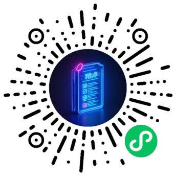

# Universal Push - 万物推进器

## 小程序体验



扫描上方二维码，立即体验万物推进器小程序


## 项目简介

万物推进器是一款智能任务管理小程序，旨在帮助用户更好地管理和分解任务，减轻心理压力。通过智能算法评估任务压力值，并提供任务拆解、进度追踪和休息提醒等功能，帮助用户更高效地完成任务。

## 主要功能

### 1. 任务管理
- 创建任务：支持添加任务标题、详细描述和截止日期
- 智能压力评估：基于任务内容和时间自动计算压力值
- 可视化展示：通过不同颜色直观显示任务压力等级

### 2. 智能任务拆解
- 一键拆解：将复杂任务自动分解为可执行的子任务
- 时间预估：为每个子任务提供合理的时间预估
- 进度追踪：实时显示任务完成进度

### 3. 休息提醒
- 智能休息提示：每完成3个子任务后提供休息建议
- 呼吸引导：提供3分钟呼吸放松引导

### 4. 成就系统
- 任务完成效果：通过烟花动画庆祝任务完成
- 进度可视化：清晰展示任务完成情况

## 技术实现

- 框架：微信小程序原生框架
- 状态管理：全局状态管理 (app.globalData)
- 数据存储：本地存储 (wx.setStorageSync)
- UI组件：自定义组件（如烟花效果组件）
- 动画效果：CSS3 动画和过渡效果

## 项目结构

```
├── assets/            # 静态资源文件
├── components/        # 自定义组件
│   └── firework/      # 烟花效果组件
├── pages/            # 页面文件
│   ├── index/        # 首页（任务列表）
│   ├── task-detail/  # 任务详情页
│   └── report/       # 报告页面
└── app.js            # 应用入口文件
```

## 使用说明

1. 创建任务
   - 点击首页的添加按钮
   - 填写任务标题和描述
   - 选择截止日期
   - 点击计算压力值
   - 确认创建任务

2. 任务拆解
   - 进入任务详情页
   - 点击"拆解任务"按钮
   - 等待系统自动生成子任务

3. 执行任务
   - 按顺序完成子任务
   - 注意休息提醒
   - 完成所有子任务后自动标记主任务完成

## 开发环境

- 微信开发者工具
- Node.js 环境

## 注意事项

- 请确保微信开发者工具已正确安装和配置
- 首次使用需要进行微信授权
- 建议定期同步本地数据